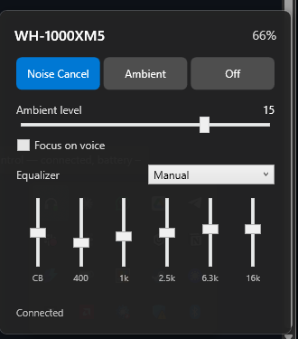

# Sony Tray

A native Windows system-tray controller for Sony headphones — the controls Sony never shipped for PC.



## Features

- Noise Cancelling / Ambient Sound / Off switching
- Ambient sound level (1–20) and Focus on Voice
- Battery: single, left/right, and charging case where the device supports it
- Full equalizer: 12 presets, 5-band + Clear Bass on XM5-class devices, 10-band on supported models
- Power-off button
- Live two-way sync with the headset's own physical controls
- Auto-reconnect
- Start with Windows
- Single self-contained ~180 MB exe — no install

## Supported devices

| Device | Status |
| --- | --- |
| WH-1000XM5 | Fully tested |
| Other Sony v2-protocol models (WH-1000XM6, WF-1000XM5, LinkBuds, ULT Wear, WH-CH720N, …) | Best-effort via capability discovery — reports welcome |
| WH-1000XM4 / WH-1000XM3 and other v1-protocol models | Not yet supported (on the roadmap) |

## How it works

Sony Tray speaks the reverse-engineered Sony MDR v2 protocol directly over Bluetooth RFCOMM (classic Bluetooth — the headset must already be paired to Windows). Rather than hardcoding one device's feature set, it queries the headset's advertised support functions at connect time and adapts the UI to whatever that device actually announces.

## Build

```
dotnet build
dotnet test
dotnet publish src/SonyTray -c Release -r win-x64 --self-contained -p:PublishSingleFile=true -p:IncludeNativeLibrariesForSelfExtract=true -o publish
```

## Diagnostics

Run `SonyTray.exe --probe` for a console harness that connects, prints the handshake, and exits — useful for checking a device before filing an issue.

Logs are written to `%AppData%\SonyTray\logs\app.log`, including raw frame hex for every message sent and received.

## Credits & license

The protocol implementation was ported from [SonyHeadphonesClient](https://github.com/mos9527/SonyHeadphonesClient) (MIT), originally by [Plutoberth](https://github.com/Plutoberth/SonyHeadphonesClient).

Tray icon via [Hardcodet.NotifyIcon.Wpf](https://github.com/hardcodet/wpf-notifyicon) (Code Project Open License).

Sony Tray is MIT licensed — see [LICENSE](LICENSE).

Sony Tray is not affiliated with, endorsed by, or sponsored by Sony. "Sony" and related product names are trademarks of Sony Group Corporation, used here only to describe compatibility.
